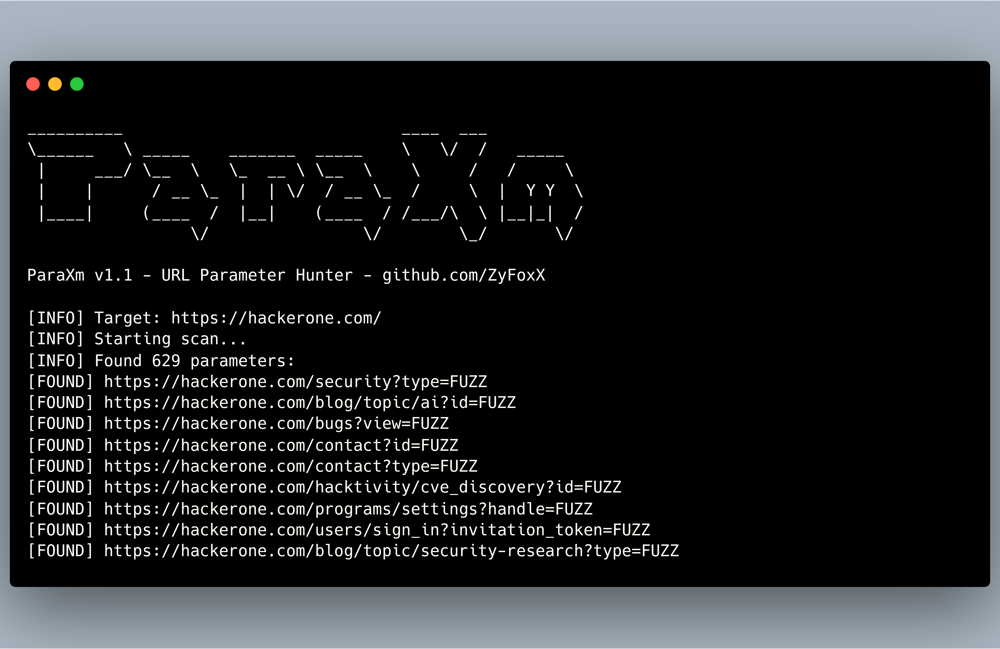

<h1 align="center">ParaXm</h1>
<h3 align="center">URL Parameter Discovery & Reconnaissance Tool</h3>

<p align="center">
   
   
</p>





## About

`ParaXm` is a fast and lightweight recon tool for uncovering juicy URL parameters deep inside web applications. Ideal for fuzzing and vulnerability testing.


## Installation

```bash
git clone https://github.com/ZyFoxX/ParaXm.git
cd ParaXm
chmod +x setup.sh
./setup.sh
```


## Usage

- Basic command
```sh
paraxm -u https://example.com/ -o results.txt
```
- Deep crawling
```sh
paraxm -u https://example.com/ -d 10 -o results.txt
```
- With rate limit
```sh
paraxm -u https://example.com -ratelimit 5 -o results.txt
```
- Using a proxy
```sh
paraxm -u https://example.com/ -p http://127.0.0.1:8080
```


## Command Line Options

| Option       | Description                                   | Example                         |
|--------------|-----------------------------------------------|---------------------------------|
| `-u`         | Target URL to scan                            | `-u https://example.com`        |
| `-o`         | Output file for discovered parameters         | `-o results.txt`                |
| `-d`         | Crawling depth (default: 2)                   | `-d 3`                          |
| `-t`         | Number of concurrent threads (default: 10)    | `-t 20`                         |
| `-ratelimit` | Maximum requests per second (default: 0/unlimited) | `-ratelimit 5`              |
| `-timeout`   | Request timeout in seconds (default: 10)      | `-timeout 15`                   |
| `-p`         | Proxy URL                                     | `-p http://127.0.0.1:8080`      |
| `-r`         | Max retries for failed requests (default: 2)  | `-r 5`                          |
| `-f`         | Follow redirects (true/false) (default: true) | `-f false`                      |
| `-h`         | Show help message                             | `-h`                            |


## Contributing

Contributions are welcome! If you'd like to contribute to `ParaXm`, please follow these steps:

1. Fork the repository.
2. Create a new branch.
3. Make your changes and commit them.
4. Submit a pull request.


## License

**MIT License** - Free to use, modify, distribute, and sublicense with only the condition that the original license and copyright notice are included. See [LICENSE](LICENSE) for details.
